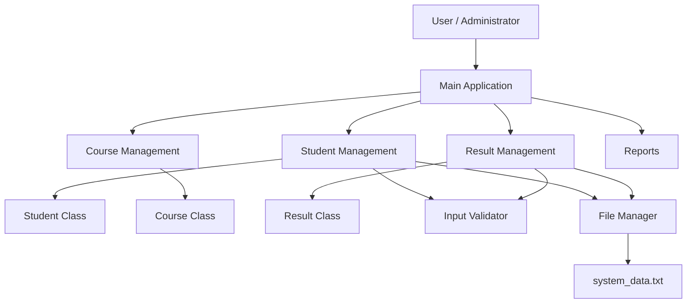

# System Architecture

## Student Course & Result Management System

The system follows a modular architecture where the main application controls different management modules. Each module is responsible for a specific function of the system.

## Architecture Components

### 1. Main Application

`Main.java` provides the command-line interface and controls the overall workflow of the application.

### 2. Student Management

`StudentManager.java` manages student records such as adding, viewing, and deleting students.

### 3. Course Management

`CourseManager.java` manages course information including course ID, course name, and credits.

### 4. Result Management

`ResultManager.java` manages student results, marks, and automatic grade calculation.

### 5. Input Validation

`InputValidator.java` validates user input such as email addresses and marks.

### 6. File Manager

`FileManager.java` provides basic file-based data logging using `system_data.txt`.

### 7. Data Classes

`Student.java`, `Course.java`, and `Result.java` represent the main data entities used by the system.

## Data Flow

User input is received through the main application. Based on the selected menu option, the request is passed to the appropriate management module. The module processes the data using the corresponding data class and validation methods. Selected operations are also logged using the File Manager.
