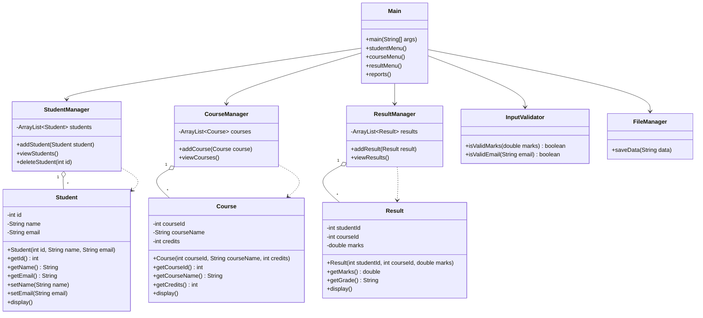

# Class Diagram

The class diagram represents the main classes of the Student Course & Result Management System and their responsibilities.

## Class Responsibilities

### Student

Stores student ID, name, and email. It provides methods to access, update, and display student information.

### Course

Stores course ID, course name, and credits and provides methods to access and display course information.

### Result

Stores student ID, course ID, and marks. It calculates the grade based on the marks.

### StudentManager

Manages student records using an `ArrayList`.

### CourseManager

Manages course records using an `ArrayList`.

### ResultManager

Manages result records using an `ArrayList`.

### InputValidator

Provides validation methods for email addresses and marks.

### FileManager

Handles basic file-based logging of system operations.

### Main

Controls the application menu and connects the different management modules.
