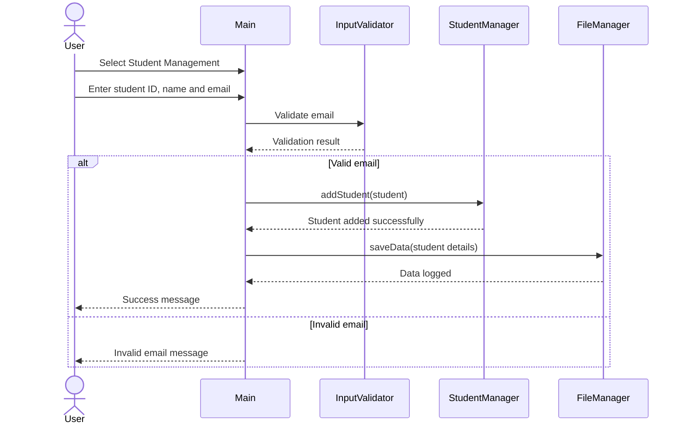
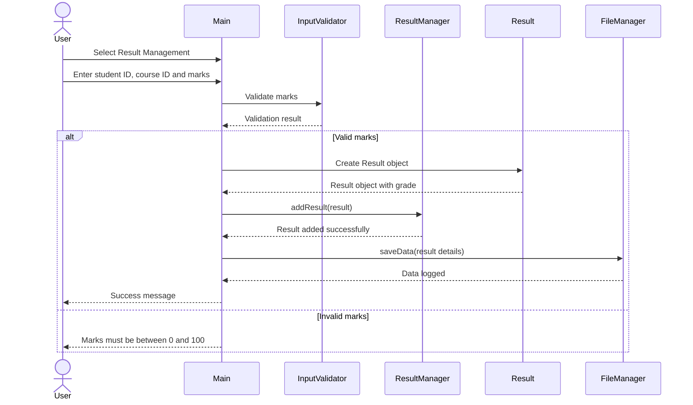

# Sequence Diagram

The sequence diagram shows the interaction between the user, main application, management modules, validation component, and file manager during common system operations.

## Student Addition Sequence

## Result Entry Sequence

## Sequence Description

1. The user selects an operation from the main menu.
2. The main application collects the required input.
3. InputValidator checks the input where validation is required.
4. The corresponding manager processes the operation.
5. A data object is created for the required entity.
6. The FileManager logs selected operations.
7. The system displays the result or an appropriate error message to the user.
