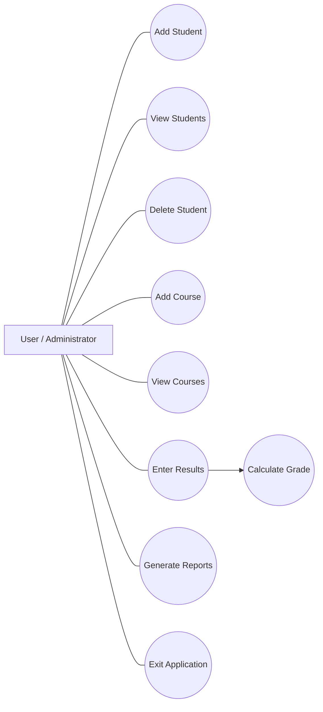

# Use Case Diagram

## Actors

The primary actor of the system is the **User/Administrator**, who interacts with the application through the command-line interface.

## Use Cases

The user can perform the following operations:

- Add Student
- View Students
- Delete Student
- Add Course
- View Courses
- Enter Results
- Calculate Grade
- Generate Reports
- Exit Application

## Use Case Description

### Student Management

The user can add new student information, view existing students, and delete a student using the student ID.

### Course Management

The user can add course details and view the available courses.

### Result Management

The user can enter student ID, course ID, and marks. The system validates the marks and calculates the corresponding grade.

### Reports

The user can view a combined report containing student, course, and result information.

### Exit

The user can terminate the application by selecting the Exit option.
