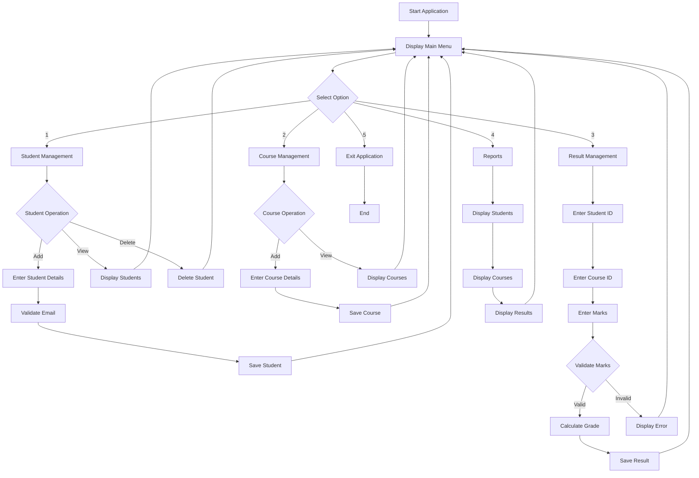

# System Workflow

## Student Course & Result Management System

The following workflow describes how the user interacts with the system from startup to exit.

## Workflow Description

1. The application starts and displays the main menu.
2. The user selects one of the available management options.
3. In Student Management, the user can add, view, or delete student records.
4. In Course Management, the user can add and view courses.
5. In Result Management, the user enters student ID, course ID, and marks.
6. The system validates the marks and calculates the corresponding grade.
7. The Reports module displays students, courses, and results.
8. The user can return to the main menu after completing an operation.
9. Selecting Exit terminates the application.
